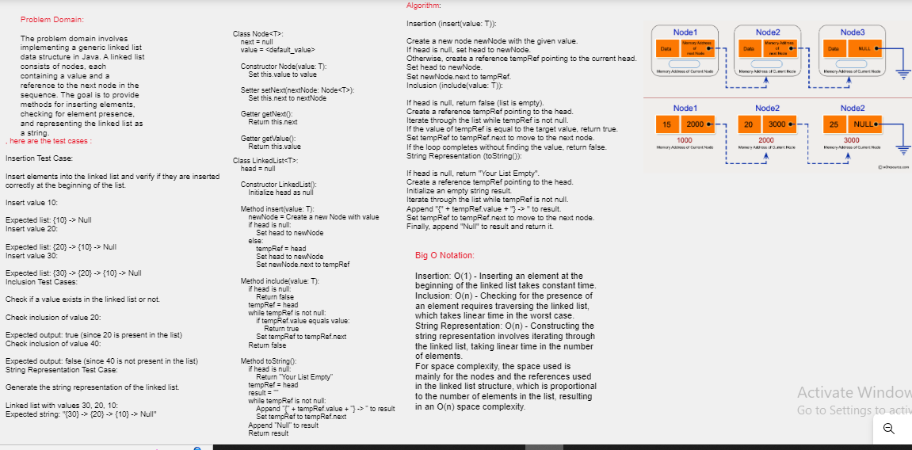

 Linked List code:
[ Linked List ](./app/src/)

Linked List
A linked list is a fundamental data structure used in computer science to store a collection of elements, also known as nodes. Unlike arrays, linked lists do not require contiguous memory allocation. Instead, each node in a linked list contains two parts: the actual data and a reference (pointer) to the next node in the sequence. This allows for efficient insertion and removal of elements, even at arbitrary positions within the list.

There are different types of linked lists, such as singly linked lists (each node points to the next node), doubly linked lists (each node points to both the next and previous nodes), and circular linked lists (the last node points back to the first node).

Problem Addressed by the Code
The code you provided is an implementation of a singly linked list data structure along with some basic operations. The main problem this code addresses is the management of a dynamic collection of elements in a linked list. Here's a breakdown of the operations the code supports:

Insertion (insert method): This operation inserts a new node with a given value at the beginning of the linked list. It effectively pushes a new element onto the front of the list.

Searching (include method): The code allows you to check whether a particular value exists in the linked list. It iterates through the list to find if the value is present or not.

String Representation (toString method): The code can generate a string representation of the linked list, showing the sequence of values in the list.

Node Class (Node<T>)
Represents a node in the linked list.
Contains a reference to the next node and a value.
App Class
A simple class with a main method to demonstrate the usage of the LinkedList class.
Inserts values into list1.

LinkedList Implementation and Complexity Analysis
LinkedList Class (LinkedList<T>)
Constructor public LinkedList()
Initializes an instance of the linked list with an empty head node.
Method public void insert(T value)
Inserts a new node with the given value at the beginning of the linked list.
Time Complexity: O(1)
Space Complexity: O(1)
Method public boolean include(T value)
Checks whether a node with the given value exists in the linked list.
Iterates through the linked list to find the value.
Time Complexity: O(n) - where n is the number of nodes in the list
Space Complexity: O(1)
Method public String toString()
Generates a string representation of the linked list.
Iterates through the linked list to create the string.
Time Complexity: O(n) - where n is the number of nodes in the list
Space Complexity: O(n) - due to the string representation

