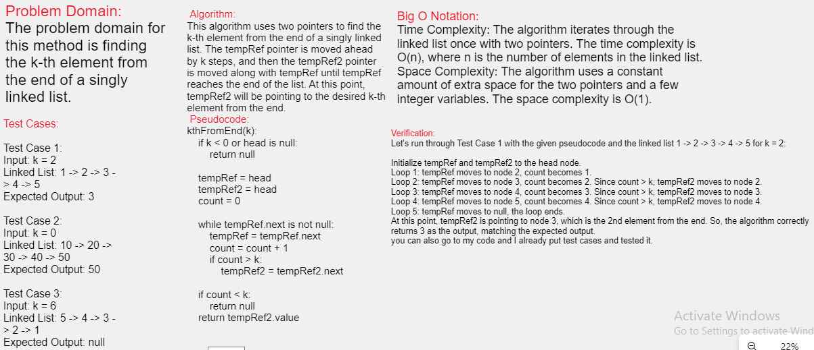

# Challenge Title
this method is finding the k-th element from the beginning of a singly linked list.
## Whiteboard Process

## Approach & Efficiency
the kth method will initialize two pointer in head the second one will move forward until k-1, and then both of them will move forward one step until second one reach to end of list ; here the position of first one will be the value

## Solution
Here is my code:
[ Linked List K-th ](./app/src/)

