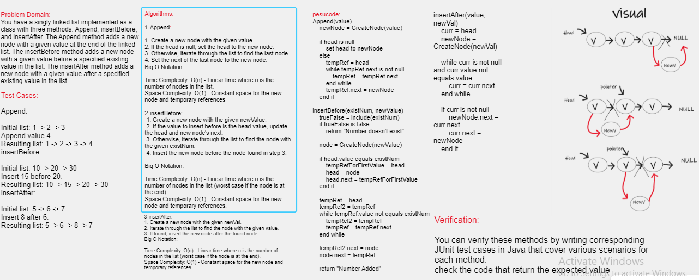

# Challenge Title
create Linked list and manipulate it by adding before and after a given node usin append,insert after and before methods.

## Whiteboard Process

## Approach & Efficiency
the insert values in the before and after methods, will start from the head and search on the specific value, if it found it will add the new value before or after it.and the append method start from head and move forward then add the new value here.

## Solution
Here is my code:
[ Linked List ](./app/src/)

