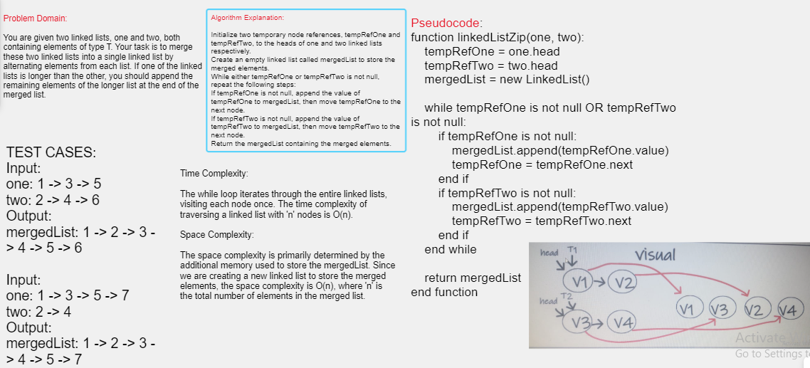

Linked List Zip
merge two linked list into one but we will take one index from each one each time we merge.

## Whiteboard Process

the zip method will receive two linked list and create two temporary referances and new linked list to add values to it then loop while the two temporary referances is not null so check the first one if not null we will add its value to our new linked lis then assign the TempRef one to next node same for the second check finally return merged linked list

Here is my code:
[ Linked List K-th ](./app/src/)
