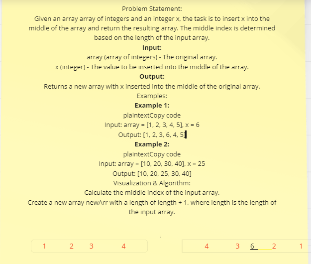
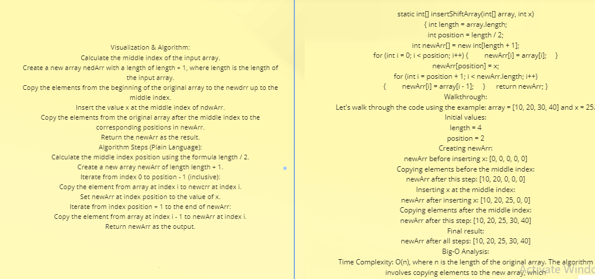

### and here is the java code I tested in compiler for two methods

 public static int[] insertShiftArray(int[]array,int x){
        int length=array.length;
        int position=length/2;//middle index
        int newArr[]=new int[length+1];//newArr
        for (int i = 0; i < position; i++) {
            newArr[i]=array[i];            
        }
        newArr[position]=x;
        for (int i= position+1; i < newArr.length; i++) {

            newArr[i]=array[i-1];
        }
        return newArr;
    }

### Also I did the optional algorothim and here its:
public static int[] deleteShiftArray(int array[]) {
    int length = array.length;
    int position = length / 2; // middle index
    int newArr[] = new int[length - 1]; // newArr

    for (int i = 0; i < position; i++) {
        newArr[i] = array[i];
    }

    for (int i = position; i < newArr.length; i++) {
        newArr[i] = array[i + 1];
    }
    return newArr;
}

  ## you can go to Main.java and I already added the code and you can test it