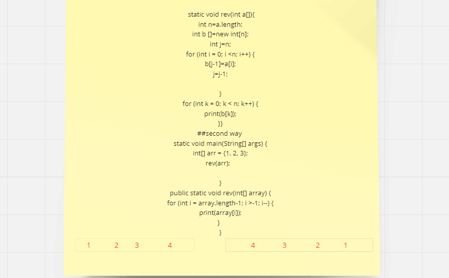
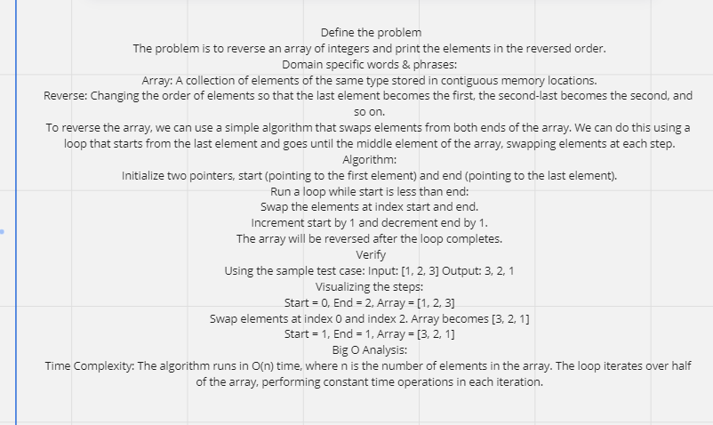

### and here is the java code I tested in compiler for two methods
##### 1
    public static void main(String[] args) {
        int a[]={1,2,3,4,5};
        rev(a);
    }
     public static void rev(int a[]){
         int n=a.length;
    int b []=new int[n];
    int j=n;
    for (int i = 0; i <n; i++) {
      b[j-1]=a[i];
      j=j-1;
      
    }
for (int k = 0; k < n; k++) {
            System.out.println(b[k]);
        }

  }

###### 2

    public static void main(String[] args) {
int[] arr = {1, 2, 3};
    rev(arr);    
        
    }
      public static void rev(int[] array) {
   for (int i = array.length-1; i >-1; i--) {
    System.out.println(array[i]);
   }   
  }

  ## you can go to Main.java and I already added the code and you can test it

