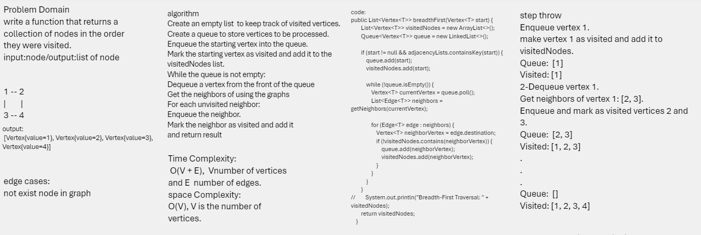
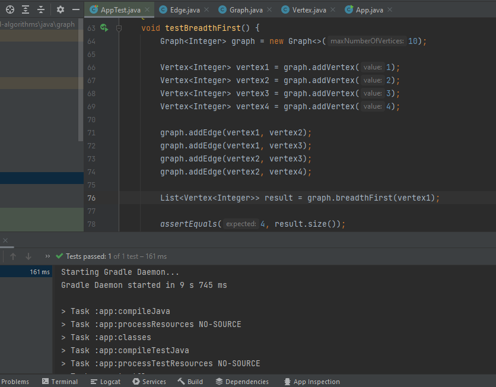

graph-breadth-first
A function called graph-breadth-first that returns a collection of nodes in the order they were visited.

## Challenge
Write the following method for the Graph class:
breadth first
Arguments: Node
Return: A collection of nodes in the order they were visited.
Display the collection

## Whiteboard Process

## Approach & Efficiency
    
The approach of the breadth-first search (BFS) algorithm is to explore a graph level by level, visiting all the neighbors of a vertex before moving on to the next level. It uses a queue to keep track of vertices to be processed, ensuring that vertices at a given level are visited before moving to the next level. The algorithm continues until all reachable vertices are visited.
## 
Time Complexity:
The time complexity of BFS is O(V + E), where V is the number of vertices and E is the number of edges. This is because, in the worst case, each vertex and each edge will be explored once.

Space Complexity:
The space complexity of BFS is O(V), where V is the number of vertices. This is due to the space required for the visitedNodes list and the queue. In the worst case, all vertices are enqueued into the queue, and the visitedNodes list will also store all vertices.

## solution:

 you can go to graph puckage then test my code by running the test app 
 