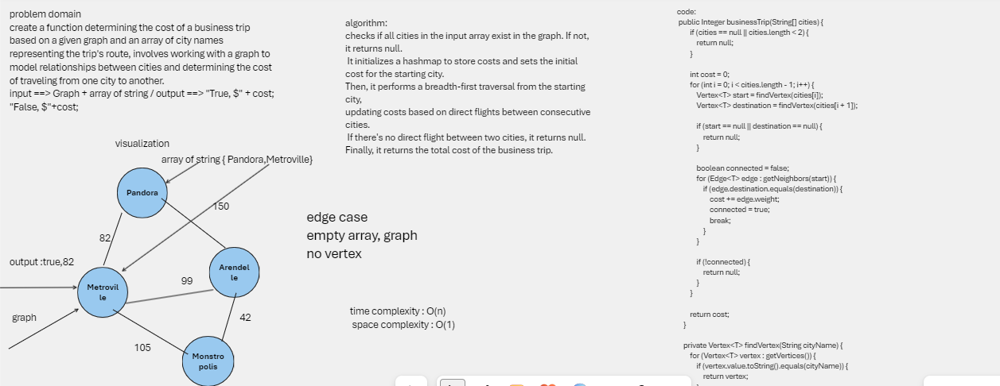
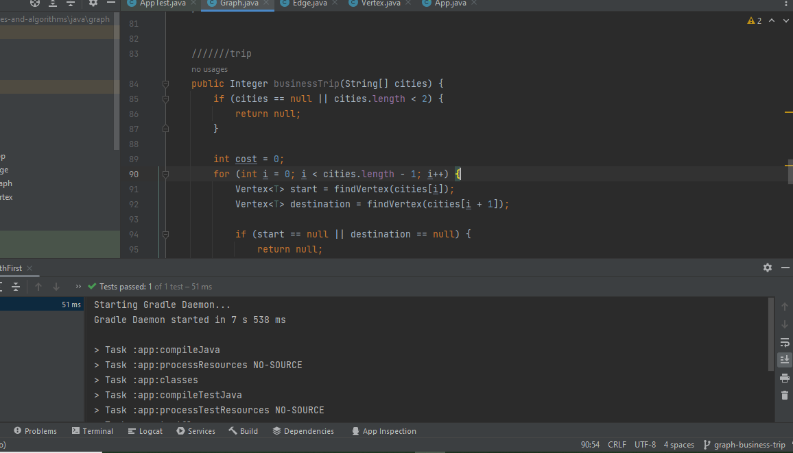

## graph-business-trip
a function called business trip that returns the cost of the trip (if it’s possible) or null (if not)

## Whiteboard Process

## Approach & Efficiency
The time complexity of the businessTrip algorithm is O(n), where n is the number of cities in the trip. This is because the algorithm iterates over the cities array once, and the findVertex and getNeighbors methods both have a constant time complexity.

The space complexity of the businessTrip algorithm is O(1), where 1 is a constant. This is because the algorithm does not allocate any additional memory that grows with the size of the input.

## solution:
 you can go to graph puckage then test my code by running the test app 
 