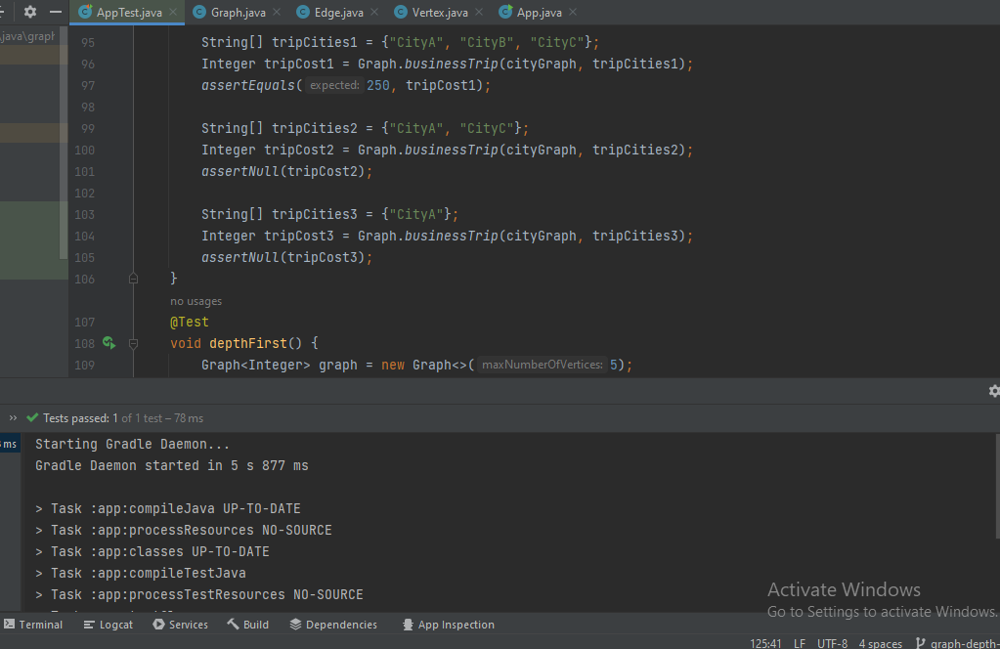

## depth first
is a graph traversal algorithm that explores as far as possible along each branch before backtracking. The main idea is to visit a vertex and then recursively visit its adjacent vertices until there are no more unvisited vertices.

## Whiteboard Process

## Approach & Efficiency
Time Complexity (Big O): O(V + E)

V is the number of vertices (nodes) in the graph.
E is the number of edges in the graph.
The time complexity is linear with respect to the sum of the vertices and edges because each vertex and each edge are visited once.

Space Complexity (Big O): O(V)

V is the number of vertices (nodes) in the graph.
The space complexity is determined by the space required for the visitedNodes list, the visitedSet set, and the stack. In the worst case, when all vertices are visited, the space complexity is O(V).

## solution:
 you can go to graph puckage then test my code by running the test app 
 

