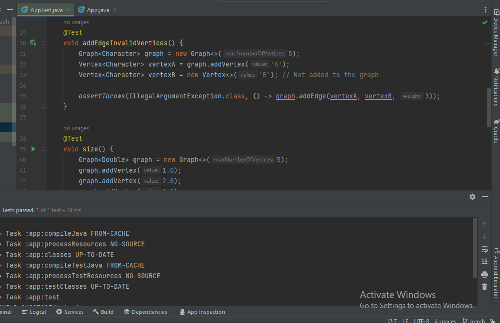

## Graphs
A graph is a data structure that consists of a set of nodes (vertices) and a set of edges connecting these nodes. It's a mathematical abstraction used to model pairwise relationships between different entities. Graphs are widely used in computer science and other fields to represent and solve problems involving relationships or connections.

## Challenge
Implement a Graph data structure and implement the methods for graph (add vertex,add edge,get vertices get neighbors,size)

## Approach & Efficiency
addVertex Time: Adding a vertex involves creating a new Vertex object and adding an entry to the adjacencyLists HashMap. Both of these operations are constant time, regardless of the number of existing vertices. Therefore, the time complexity for adding a vertex is O(1), and the space complexity is also O(1).

addedge Time:  creating a new Edge object and adding it to the list of edges for a specific vertex. Both operations are constant time  the time complexity for adding an edge is O(1), and the space complexity is also O(1).

getVertex Time: O(1), Space: O(n): n is the number of nodes
getNeighbors Time: O(1), Space: O(m) (m is the number of neighbor nodes) operation is constant time because the list of edges is stored in a HashMap. The space complexity is O(m) because, in the worst case, a vertex can be connected to all other vertices in the graph.

size , Time: O(n): n is the number of nodes , Space: O(1)

addVertex(T value):

 Adds a new vertex with the specified value to the graph.

addEdge(Vertex<T> start, Vertex<T> destination):

 Adds an unweighted edge between the specified vertices.

addEdge(Vertex<T> start, Vertex<T> destination, int weight):
 Adds a weighted edge between the specified vertices.

getVertices():

 Returns a list of all vertices in the graph.

getNeighbors(Vertex<T> vertex):

 Returns a list of edges representing neighbors of the specified vertex.

size():

 Returns the number of vertices in the graph.

 ## solution:

 you can go to graph puckage then test my code by running the test app 
 
