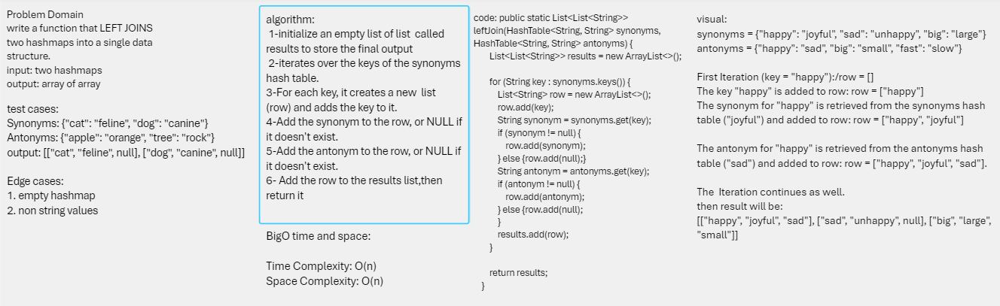
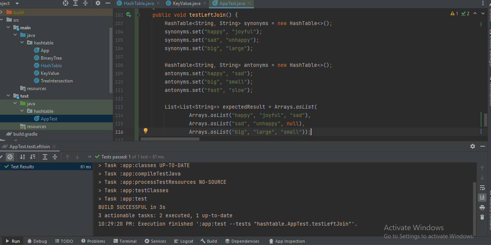

## LEFT JOIN
This  implements a basic HashMap with additional functionality for a left join operation on two hash maps containing synonyms and antonyms.

##  Whiteboard Process

## Approach & Efficiency

The leftJoin method is designed to perform a left join operation on two hash maps (synonymMap and antonymMap).

Time Complexity:
The time complexity of method is determined by the loop that iterates over the keys of the synonyms hash table.  where there are n keys in the synonyms hash table, the time complexity is O(n).

Space Complexity:
The space complexity is determined by the additional data structures created during the execution of the method. I create a new list (row) for each key and add it to the results list,so the space complexity of  leftJoin method is O(n)

## solution

you can go to hashtable puckage then test my code by running the test app 
