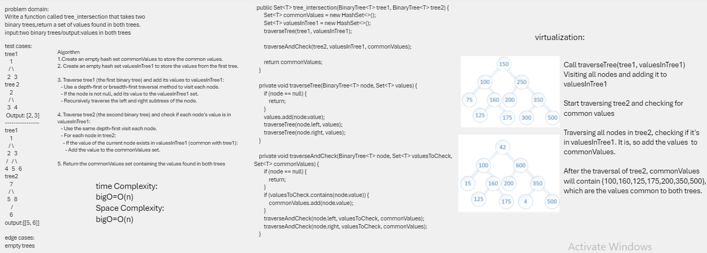
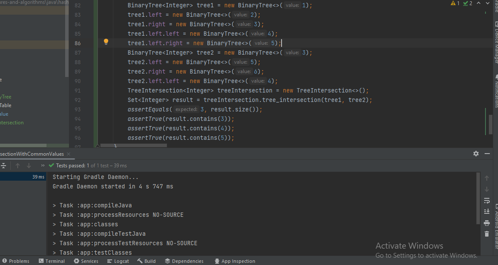

## tree-intersection
A function called tree_intersection that finds common values in two binary trees.

##  Whiteboard Process

## Approach & Efficiency
code starts by traversing tree1 and populating a valuesInTree1 set with all the values in tree1. This is done using a recursive depth-first traversal, where each node's value is added to the set.

Then, it traverses tree2 and checks if each node's value is present in the valuesInTree1 set. If a common value is found, it is added to the commonValues set. This is also done using a recursive depth-first traversal.

Time complexity: is O(min(n1, n2)), number of common values cannot exceed the number of values in the smaller set. This ensures that the complexity doesn't exceed O(min(n1, n2)) even when all values are common.

Space complexity: is O(max(n1, n2)), because it's determined by the larger of the two sets (values of Tree1) or (values ofTree2), since it cannot exceed the size of the smaller set.

## solution
you can go to BinaryTree puckage then test my code by running the test app 
