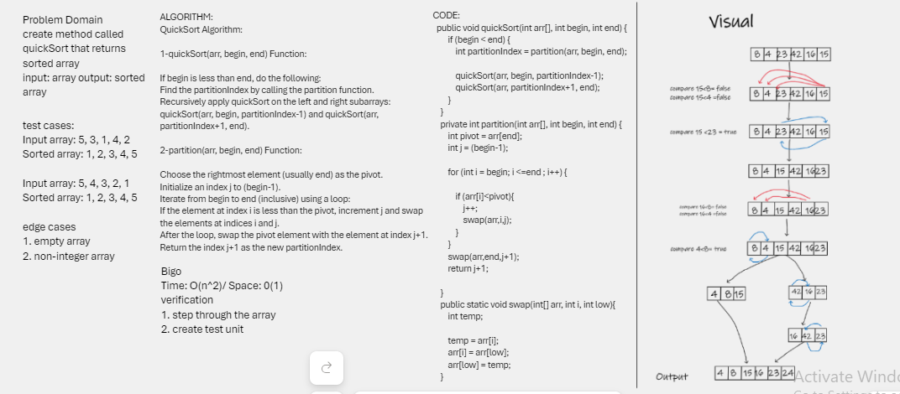

## Quick Sort
Quick Sort is a sorting algorithm that divides an array into divisions in a recursive manner based on the outcome of sorting the current partition by a pivot point. The array is partitioned and sorted until it is in sorted order throughout.
Pseudocode
ALGORITHM QuickSort(arr, left, right)
if left < right
// Partition the array by setting the position of the pivot value
DEFINE position <-- Partition(arr, left, right)
// Sort the left
QuickSort(arr, left, position - 1)
// Sort the right
QuickSort(arr, position + 1, right)

ALGORITHM Partition(arr, left, right)
// set a pivot value as a point of reference
DEFINE pivot <-- arr[right]
// create a variable to track the largest index of numbers lower than the defined pivot
DEFINE low <-- left - 1
for i <- left to right do
if arr[i] <= pivot
low++
Swap(arr, i, low)

     // place the value of the pivot location in the middle.
     // all numbers smaller than the pivot are on the left, larger on the right. 
     Swap(arr, right, low + 1)
    // return the pivot index point
     return low + 1

ALGORITHM Swap(arr, i, low)
DEFINE temp;
temp <-- arr[i]
arr[i] <-- arr[low]
arr[low] <-- temp

## Whiteboard Process

###merge sort:

Here is my code:
[ quicksort  ](./app/src/main/java/sort/Sort.java)

and here is test of my code
[ quicksort  ](./app/src/test/java/stackandqueue/SortTest.java)